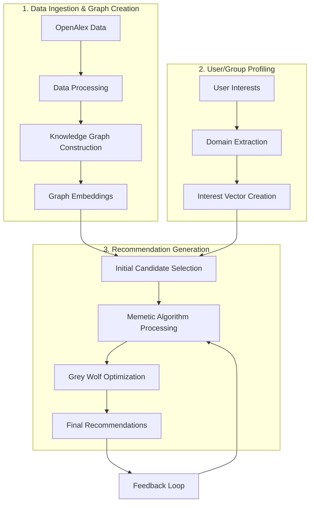

```mermaid
flowchart TD
    subgraph Data_Ingestion["1. Data Ingestion & Graph Creation"]
        A[OpenAlex Data] --> B[Data Processing]
        B --> C[Knowledge Graph Construction]
        C --> D[Graph Embeddings]
    end

    subgraph User_Profiling["2. User/Group Profiling"]
        E[User Interests] --> F[Domain Extraction]
        F --> G[Interest Vector Creation]
    end

    subgraph Recommendation["3. Recommendation Generation"]
        H[Initial Candidate Selection]
        I[Memetic Algorithm Processing]
        J[Grey Wolf Optimization]
        K[Final Recommendations]

        H --> I
        I --> J
        J --> K
    end

    D --> H
    G --> H
    K --> L[Feedback Loop]
    L --> I
```