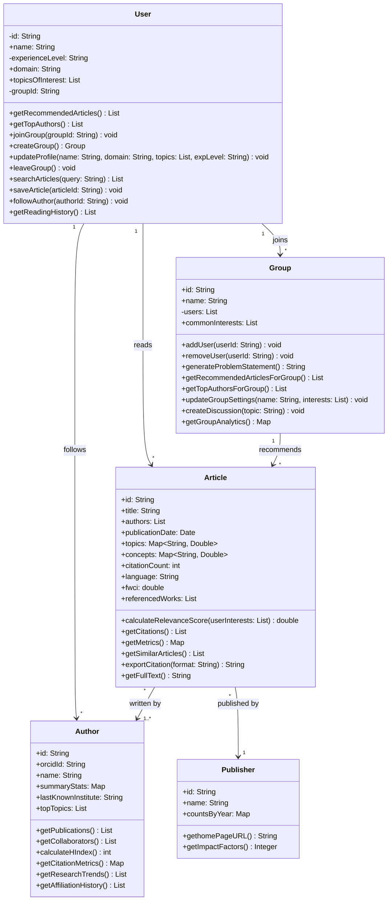

```mermaid
%% classDiagram
%%     class User {
%%         +String id
%%         +String name
%%         +String email
%%         +String experienceLevel
%%         +String domain
%%         +List<String> topicsOfInterest
%%         +String groupId
%%         +List<ArticleRecommendation> getRecommendedArticles()
%%         +List<Author> getTopAuthors()
%%         +void joinGroup(String groupId)
%%         +void updateProfile(String name, String domain, List<String> topics)
%%     }

%%     class Group {
%%         +String id
%%         +String name
%%         +List<User> users
%%         +List<String> commonInterests
%%         +String recommendedProblemStatement
%%         +void addUser(User user)
%%         +void removeUser(String userId)
%%         +String generateProblemStatement()
%%     }

%%     class Article {
%%         +String id
%%         +String title
%%         +List<Author> authors
%%         +Date publicationDate
%%         +List<String> keywords
%%         +int citationCount
%%         +List<String> getAuthorNames()
%%         +int getCitations()
%%     }

%%     class Author {
%%         +String id
%%         +String name
%%         +String affiliation
%%         +int hIndex
%%         +List<String> researchAreas
%%         +List<Article> getPublishedArticles()
%%         +List<Article> getTopCitations()
%%     }

%%     class ArticleRecommendation {
%%         +String id
%%         +String userId
%%         +String articleId
%%         +float score
%%         +float getRecommendationScore()
%%         +float compareWith(ArticleRecommendation other)
%%     }

%%     class ProblemStatementRecommendation {
%%         +String id
%%         +String groupId
%%         +String problemStatement
%%         +float confidenceScore
%%         +String generateBasedOnInterests(Group group)
%%     }

%%     User --|> Group : belongs to
%%     Group --* User : contains
%%     User --* ArticleRecommendation : has many
%%     Article --* Author : has many
%%     ArticleRecommendation --|> User : links
%%     ArticleRecommendation --|> Article : links
%%     Group --|> ProblemStatementRecommendation : has
classDiagram
    class User {
        -id: String
        +name: String
        -experienceLevel: String
        +domain: String
        +topicsOfInterest: List
        -groupId: String
        +getRecommendedArticles() List
        +getTopAuthors() List
        +joinGroup(groupId: String) void
        +createGroup() Group
        +updateProfile(name: String, domain: String, topics: List, expLevel: String) void
        +leaveGroup() void
        +searchArticles(query: String) List
        +saveArticle(articleId: String) void
        +followAuthor(authorId: String) void
        +getReadingHistory() List
    }

    class Group {
        +id: String
        +name: String
        -users: List
        +commonInterests: List
        +addUser(userId: String) void
        +removeUser(userId: String) void
        +generateProblemStatement() String
        +getRecommendedArticlesForGroup() List
        +getTopAuthorsForGroup() List
        +updateGroupSettings(name: String, interests: List) void
        +createDiscussion(topic: String) void
        +getGroupAnalytics() Map
    }

    class Article {
        +id: String
        +title: String
        +authors: List
        +publicationDate: Date
        +topics: Map~String, Double~
        +concepts: Map~String, Double~
        +citationCount: int
        +language: String
        +fwci: double
        +referencedWorks: List
        +calculateRelevanceScore(userInterests: List) double
        +getCitations() List
        +getMetrics() Map
        +getSimilarArticles() List
        +exportCitation(format: String) String
        +getFullText() String
    }

    class Author {
        +id: String
        +orcidId: String
        +name: String
        +summaryStats: Map
        +lastKnownInstitute: String
        +topTopics: List
        +getPublications() List
        +getCollaborators() List
        +calculateHIndex() int
        +getCitationMetrics() Map
        +getResearchTrends() List
        +getAffiliationHistory() List
    }

    class Publisher {
        +id: String
        +name: String
        +countsByYear: Map
        +gethomePageURL() String
        +getImpactFactors() Integer
    }

    User "1" --> "*" Group : joins
    User "1" --> "*" Article : reads
    User "1" --> "*" Author : follows
    Group "1" --> "*" Article : recommends
    Article "*" --> "1..*" Author : written by
    Article "*" --> "1" Publisher : published by
```