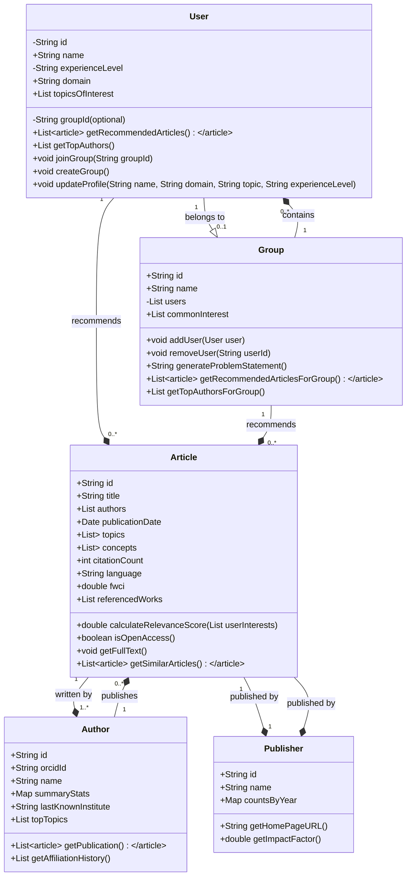

```mermaid
classDiagram
    class User {
        -String id
        +String name
        -String experienceLevel
        +String domain
        +List<String> topicsOfInterest
        -String groupId (optional)
        +List<Article> getRecommendedArticles()
        +List<Author> getTopAuthors()
        +void joinGroup(String groupId)
        +void createGroup()
        +void updateProfile(String name, String domain, String topic, String experienceLevel)
    }

    class Group {
        +String id
        +String name
        -List<User> users
        +List<String> commonInterest
        +void addUser(User user)
        +void removeUser(String userId)
        +String generateProblemStatement()
        +List<Article> getRecommendedArticlesForGroup()
        +List<Author> getTopAuthorsForGroup()
    }

    class Article {
        +String id
        +String title
        +List<Author> authors
        +Date publicationDate
        +List<Tuple<String, double>> topics
        +List<Tuple<String, double>> concepts
        +int citationCount
        +String language
        +double fwci
        +List<String> referencedWorks
        +double calculateRelevanceScore(List<String> userInterests)
        +boolean isOpenAccess()
        +void getFullText()
        +List<Article> getSimilarArticles()
    }

    class Author {
        +String id
        +String orcidId
        +String name
        +Map<String, double> summaryStats
        +String lastKnownInstitute
        +List<String> topTopics
        +List<Article> getPublication()
        +List<String> getAffiliationHistory()
    }

    class Publisher {
        +String id
        +String name
        +Map<int, int> countsByYear
        +String getHomePageURL()
        +double getImpactFactor()
    }

    User "1" --|> "0..1" Group : belongs to
    Group "1" --* "0..*" User : contains
    User "1" --* "0..*" Article : recommends
    Group "1" --* "0..*" Article : recommends
    Article "1" --* "1..*" Author : written by
    Author "1" --* "0..*" Article : publishes
    Article "1" --* "1" Publisher : published by
  Article --* Publisher : published by

```