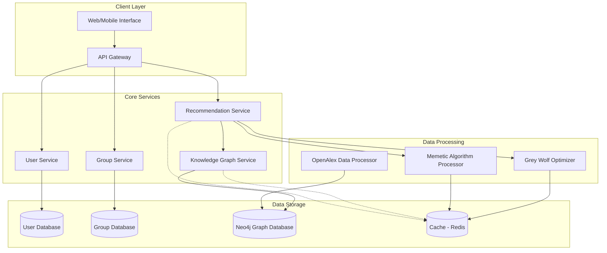

```mermaid
graph TD
    subgraph Client["Client Layer"]
        UI[Web/Mobile Interface]
        API_Gateway[API Gateway]
    end

    subgraph Core_Services["Core Services"]
        US[User Service]
        GS[Group Service]
        RS[Recommendation Service]
        KG[Knowledge Graph Service]
    end

    subgraph Data_Processing["Data Processing"]
        OA[OpenAlex Data Processor]
        GWO[Grey Wolf Optimizer]
        MM[Memetic Algorithm Processor]
    end

    subgraph Data_Storage["Data Storage"]
        UD[(User Database)]
        GD[(Group Database)]
        NGD[(Neo4j Graph Database)]
        CD[(Cache - Redis)]
    end

    UI --> API_Gateway
    API_Gateway --> US
    API_Gateway --> GS
    API_Gateway --> RS

    US --> UD
    GS --> GD
    
    RS --> KG
    RS --> GWO
    RS --> MM
    
    KG --> NGD
    
    OA --> NGD
    
    GWO --> CD
    MM --> CD
    
    KG -.-> CD
    RS -.-> CD
```